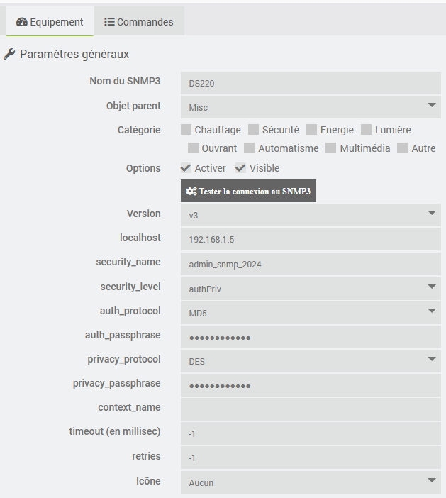
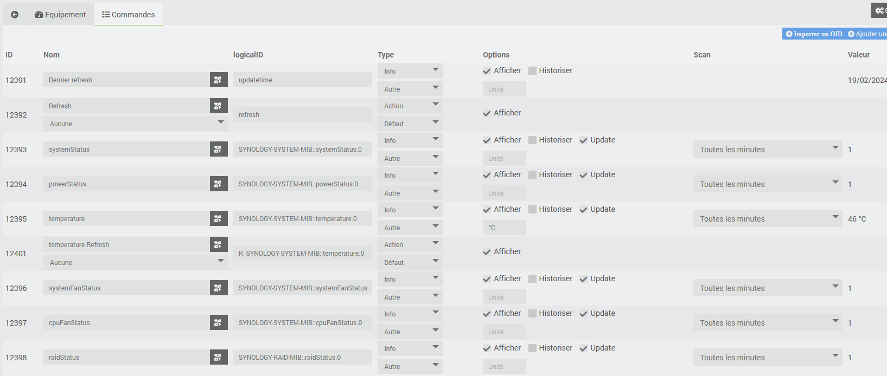
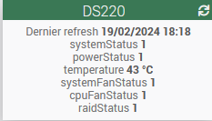

 # Plugin SNMP3

Plugin permettant de s'interfacer avec les dispositifs supportant le protocol SNMP. 

SNMP est l'un des protocoles largement acceptés pour gérer et analyser les éléments du réseau. La plupart des éléments de réseau de qualité professionnelle sont fournis avec un agent SNMP intégré.

Le plugin utilise le package php-snmp (voir <https://www.php.net/manual/fr/book.snmp.php>) qui est un wrapper de la bibliothèque Net-SNMP. Le plugin permet d'interroger et de mettre à jour les OID qui le supportent.

 # AVERTISSEMENT

Ce plugin s'adresse à des personnes qui sont familières avec le protocole. 

Celui-ci n'est pas particulièrement compliqué mais nécessite quand même de maitriser les concepts qui le sous-tendent (authentification, OID, MIB, ...).

Avant de contacter le développeur pour d'éventuels problèmes, vérfiier d'abord que les paramètres pour la communication avec le dispositif SNMP sont corrects.

Pour cela, on peut utiliser dans une session ssh la commande snmpget par exemple:

    snmpget -v 3 -n "" -u admin_snmp_2024 -a MD5 -A "Camille" -x DES -X "Camille" -l authPriv 192.168.1.5 .1.3.6.1.4.1.6574.1.5.1.0

# Installation et configuration des dispositifs SNMP

Le bon fonctionnement du plugin suppose que le protocole SNMP soit correctement installé et configuré sur le système cible. Se reporter à la documentation du fabriquant pour réaliser cette configuration.

Le protocole v3 est conseillé afin de sécuriser la connexion.

Tester les paramètres de connexion avec la commande snmpget ou d'autres utilitaires. 

# Configuration du plugin

Une fois le plugin installé, il faut l'activer. Le package php-snmp est installé lors de l'activation.

Vous pouvez activer le niveau de log Debug pour suivre l'activité du plugin et identifier les éventuels problèmes.

# Gestion des MIBs

On peut désigner les OID par leur code direct par exemple .1.3.6.1.4.1.6574.1.1.0 ou en utilisant la MIB correspondante par exemple SYNOLOGY-SYSTEM-MIB::systemStatus.0 .

Lors de l'installation du package php-snmp, un certain nombre de MIBs sont installées (normalement dans le répertoire /usr/share/snmp/mibs) et peuvent être utilisées directement.

Le plugin permet d'installer des MIBs spécifiques en plaçant les fichiers correspondant dans le répertoire plugins\SNMP3\data\mibs .

Si vous rencontrez des difficultés dans la mise en oeuvre des MIBs, vous pouvez les tester avec la commande snmptranslate (voir <https://net-snmp.sourceforge.io/tutorial/tutorial-5/commands/snmptranslate.html>).

# Configuration des équipements

La configuration des équipements est accessible à partir du menu du plugin (menu Plugins, Objets Connectés puis SNMP3). 

Cliquer sur Ajouter pour définir le dispositif SNMP3.

Indiquer la configuration du SNMP3 :

-   **Nom** : nom du SNMP3
-   **Objet parent** : indique l’objet parent auquel appartient l’équipement
-   **Catégorie** : indique la catégorie Jeedom de l’équipement
-   **Activer** : permet de rendre l'équipement actif
-   **Version** : version de SNMP
-   **localhost** : IP de l’équipement
-   **Paramètres de sécurité** : voir <https://www.php.net/manual/fr/snmp.setsecurity.php>
-   **Icone** : permet de sélectionner un type d'icône pour l'équipement dans le paneau de configuration

Il est possible de personaliser une icone de type perso en ajoutant l'image correspondante (par exemple perso1.png pour l'icone perso1) dans le répertoire plugin_info du plugin.

Le boutons   **Tester la connexion au SNMP3** permet de tester si les paramètres de connexion sont corrects (penser à sauvegarder la configuration avant de cliquer sur le bouton).

# Commandes associées aux équipements

Par défaut, deux commandes sont créées :

- Dernier Refresh : commande info indiquant quand la dernière information du SNMP3 a été mise à jour
- Refresh: commande action permettant de mettre à jour tous les OID pour lesquels l'update est activé

Les boutons suivants sont disponibles :

- Importer un OID : permet de créer une commande info pour un OID
- Ajouter une commande refresh : permet de forcer la récupération de la valeur du paramètre
- Ajouter une action : permet de modifier la valeur du paramètre (lorsque c'est permis par le dispositif SNMP)

# Analyse des champs de la commande

Pour chaque commande relative à un OID, on trouve en plus des champs habituels de jeedom :

- le LogicalID: 
  - pour les commandes de type info, égal au code du paramètre
  - pour les commandes refresh, égal à 'R_' suivi du code du paramètre
  - pour les commandes action, égal à 'A_' suivi du code du paramètre
- la coche update qui permet de demander ou non la mise à jour du paramètre
- le champ scan qui indique la fréquence de mise à jour du paramètre

Pour les commandes de type Action, le type d'action détermine le format de la valeur transmise au dispositif SNMP. Lorsque le type est 'Message', le titre donne le format et le contenu du message donne la valeur (seule la première ligne est transmise). Voir <https://www.php.net/manual/fr/function.snmpset.php> pour plus d'information. 

# Widget

Voici un exemple de widget. On peut modifier le nom des commandes pour que ce soit plus parlant. 
